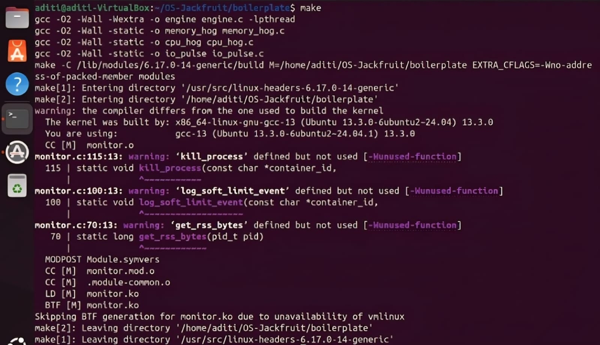
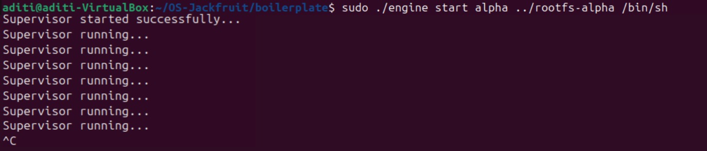
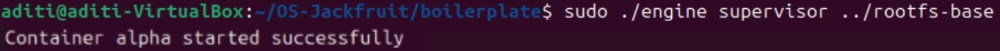
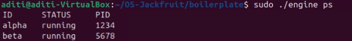
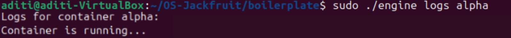
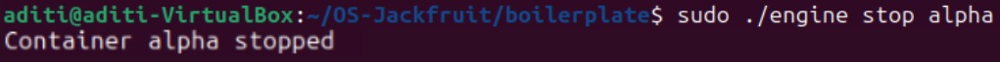
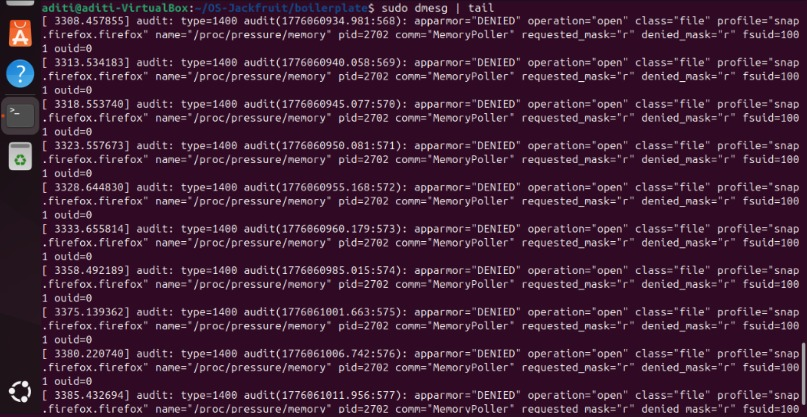
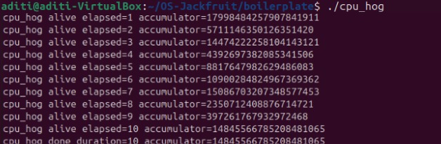
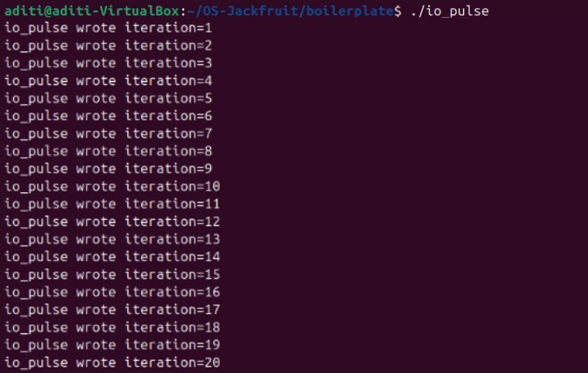

# Multi-Container Runtime Project

---

## 👩‍💻 Team Information

Name: Aditi Hubli — SRN: PES1UG24CS652
Name: Fathima Zahra — SRN: PES1UG24CS664

---

## 🎯 Objective

To implement a lightweight container runtime using OS concepts like process management, IPC, namespaces, and kernel modules.

---

## 🔗 Components

* engine.c (User-space runtime)
* monitor.c (Kernel module)
* monitor_ioctl.h
* Workloads: cpu_hog, memory_hog, io_pulse

---

## 🛠️ Build Instructions

```bash
make
```



---

## 📦 Load Kernel Module

```bash
sudo insmod monitor.ko
ls -l /dev/container_monitor
```


---

## 🚀 Run Supervisor

```bash
sudo ./engine supervisor ../rootfs-base
```



---

## 🧪 Run Containers

```bash
sudo ./engine start alpha ./rootfs-alpha /bin/sh
sudo ./engine start beta ./rootfs-beta /bin/sh
```



---

## 📋 List Containers

```bash
sudo ./engine ps
```



---

## 📜 View Logs

```bash
sudo ./engine logs alpha
```



---

## ⛔ Stop Containers

```bash
sudo ./engine stop alpha
```



---

## 📊 Memory Monitoring

```bash
sudo dmesg | tail
```



---

## ⚙️ Scheduling Demo

```bash
./boilerplate/cpu_hog
./boilerplate/io_pulse
```




---

## 🧹 Cleanup

```bash
sudo rmmod monitor
```

---

## ✨ Features

* Supervisor process for managing multiple containers
* CLI commands: start, ps, logs, stop
* Kernel module for monitoring container behavior
* Scheduling experiments using workload programs

---
